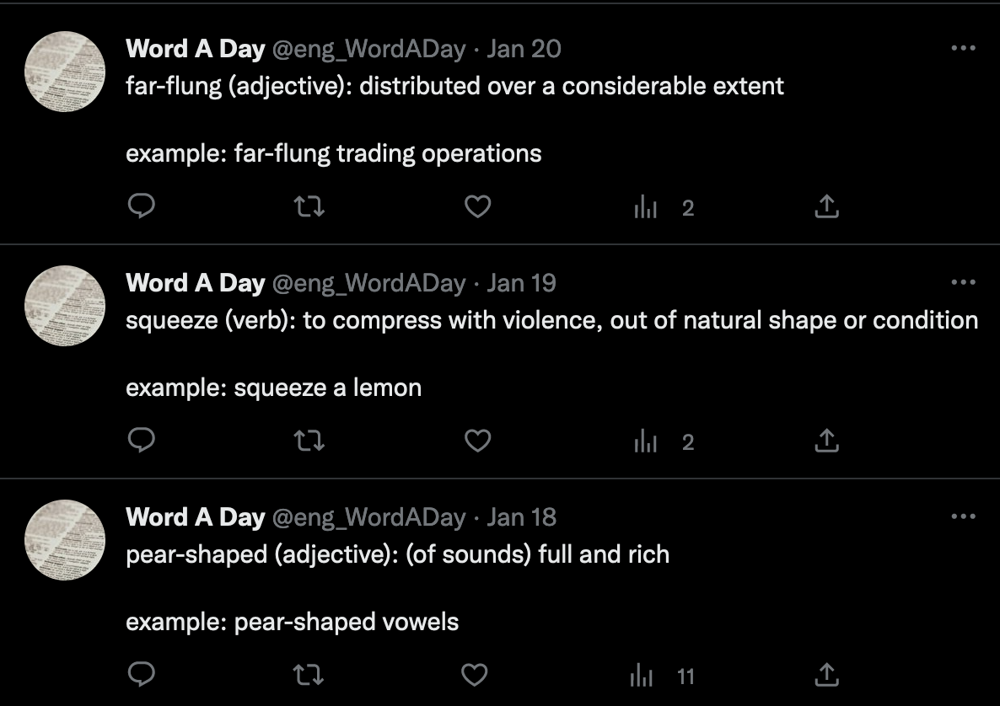

# Word A Day - A Twitter Bot
A Twitter bot that uses the [WordsAPI](https://rapidapi.com/dpventures/api/wordsapi) to tweet a new random dictionary entry  everyday. The bot is written in Python and is designed to be deployed as an AWS Lambda function.

## Requirements
- [AWS CLI](https://aws.amazon.com/cli/)
- [Terraform](https://www.terraform.io/)
- [WordsAPI Credentials](https://rapidapi.com/dpventures/api/wordsapi)
- [Twitter Developer Account](https://developer.twitter.com)

## Project Structure
`index.py` - the lambda function code that retrieves and tweets a new dictionary entry.

`lambda_layer.zip` - lambda layer containing required python packages to run the lambda function.

`terraform/` - contains the infrastructure code to create the AWS Lambda and Cloudwatch resources.

## Deployment
Deployment is done using Terraform. Running `terraform apply` will automatically zip the lambda function code and create the require lambda and cloudwatch resources. AWS credentials should be set using AWS CLI profiles prior to running `apply`.

